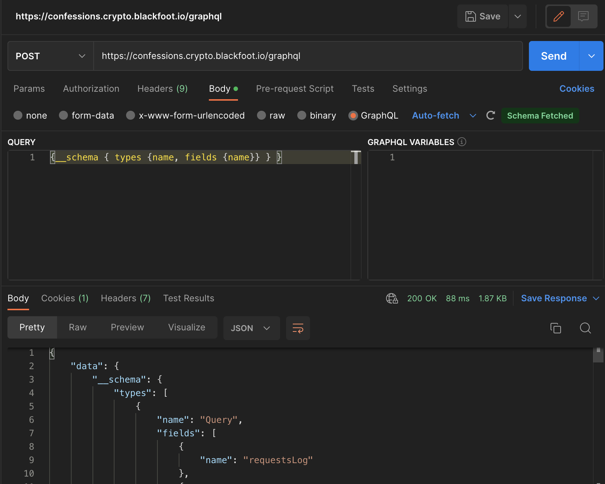

# Cryptography

## BASIC1

(https://crypto.blackfoot.io/)

THE INTERLOCKING NETWORK OF STALKS AND BRANCHES AND CREEPERS WAS SKELETAL, THE FOSSIL YARD OF AN EXTINCT SPECIES OF FINEBONED INSECTOID CREATURES.
ALL OF THESE BONES, THEN, SEEMED TO HAVE BEEN STAINED BY SUN AND EARTH FROM AN ORIGINAL LIVING WHITE TO BROWN, AND NOT THE TOUGH FIBROUS FLOWER AND
SEED-SPILLING GREEN THEY ACTUALLY ONCE HAD BEEN. HOWARD WONDERED ABOUT A MAN WHO HAD NEVER SEEN SUMMER, A WINTER MAN, EXAMINING THE WEEDS AND MAKING
THIS INFERENCE -- THAT HE WAS LOOKING AT AN OSSUARY. THE MAN WOULD TAKE THAT AS TRUE AND BASE HIS IDEAS OF THE WORLD ON THAT MISTAKE. 'AH,' SAID GANDALF,
'NOW WE COME TO IT. I THINK GOLLUM TRIED TO. HE SET OUT AND CAME BACK WESTWARD, AS FAR AS THE GREAT RIVER. BUT THEN HE TURNED ASIDE. HE WAS NOT
DAUNTED BY THE DISTANCE, I AM SURE. NO, SOMETHING ELSE DREW HIM AWAY. SO MY FRIENDS THINK, THOSE THAT HUNTED HIM FOR ME. 'THE WOOD-ELVES TRACKED HIM
FIRST, AN EASY TASK FOR THEM, FOR HIS TRAIL WAS STILL FRESH THEN. THROUGH MIRKWOOD AND BACK AGAIN IT LED THEM, THOUGH THEY NEVER CAUGHT HIM. THE WOOD
WAS FULL OF THE RUMOUR OF HIM, DREADFUL TALES EVEN AMONG BEASTS AND BIRDS. THE WOODMEN SAID THAT THERE WAS SOME NEW TERROR ABROAD, A GHOST THAT DRANK
BLOOD. IT CLIMBED TREES TO FIND NESTS; IT CREPT INTO HOLES TO FIND THE YOUNG; IT SLIPPED THROUGH WINDOWS TO FIND CRADLES. 'BUT AT THE WESTERN EDGE OF
MIRKWOOD THE TRAIL TURNED AWAY. IT WANDERED OFF SOUTHWARDS AND PASSED OUT OF THE WOOD-ELVES' KEN, AND WAS LOST. AND THEN I MADE A GREAT MISTAKE. YES,
FRODO, AND NOT THE FIRST; THOUGH I FEAR IT MAY PROVE THE WORST. I LET THE MATTER BE. I LET HIM GO; FOR I HAD MUCH ELSE TO THINK OF AT THAT TIME, AND
I STILL TRUSTED THE LORE OF SARUMAN. 'WELL, THAT WAS YEARS AGO. I HAVE PAID FOR IT SINCE WITH MANY DARK AND DANGEROUS DAYS. THE TRAIL WAS LONG COLD WHEN
I TOOK IT UP AGAIN, AFTER BILBO LEFT HERE. AND MY SEARCH WOULD HAVE BEEN IN VAIN, BUT FOR THE HELP THAT I HAD FROM A FRIEND: ARAGORN, THE GREATEST
TRAVELLER AND HUNTSMAN OF THIS AGE OF THE WORLD. TOGETHER WE SOUGHT FOR GOLLUM DOWN THE WHOLE LENGTH OF WILDERLAND, WITHOUT HOPE, AND WITHOUT SUCCESS.
BUT AT LAST, WHEN I HAD GIVEN UP THE CHASE AND TURNED TO OTHER PARTS, GOLLUM WAS FOUND

'AH,' SAID PANDALF, 'NOW WE COME TO IT. I THING POLLUM TRIED TO. HE SET OUT AND CAME BACG WESTWARD, AS FAR AS THE PREAT RIVER. BUT THEN HE TURNED ASIDE.
HE WAS NOT DAUNTED BY THE DISTANCE, I AM SURE. NO, SOMETHINP ELSE DREW HIM AWAY. SO MY FRIENDS THING, THOSE THAT HUNTED HIM FOR ME.

'THE WOOD-ELVES TRACKED HIM FIRST, AN EASY TASK FOR THEM, FOR HIS TRAIL WAS STILL FRESH THEN. THROUGH MIRKWOOD AND BACK AGAIN IT LED THEM, THOUGH THEY
NEVER CAUGHT HIM. THE WOOD WAS FULL OF THE RUMOUR OF HIM, DREADFUL TALES EVEN AMONG BEASTS AND BIRDS. THE WOODMEN SAID THAT THERE WAS SOME NEW TERROR
ABROAD, A GHOST THAT DRANK BLOOD. IT CLIMBED TREES TO FIND NESTS; IT CREPT INTO HOLES TO FIND THE YOUNG; IT SLIPPED THROUGH WINDOWS TO FIND CRADLES.

'BUT AT THE WESTERN EDGE OF MIRKWOOD THE TRAIL TURNED AWAY. IT WANDERED OFF SOUTHWARDS AND PASSED OUT OF THE WOOD-ELVES' KEN, AND WAS LOST. AND THEN
I MADE A GREAT MISTAKE. YES, FRODO, AND NOT THE FIRST; THOUGH I FEAR IT MAY PROVE THE WORST. I LET THE MATTER BE. I LET HIM GO; FOR I HAD MUCH ELSE
TO THINK OF AT THAT TIME, AND I STILL TRUSTED THE LORE OF SARUMAN.

'WELL, THAT WAS YEARS AGO. I HAVE PAID FOR IT SINCE WITH MANY DARJ AND DANGEROUS DAYS. THE TRAIL WAS LONG COLD WHEN I TOOJ IT UP AGAIN, AFTER BILBO
LEFT HERE. AND MY SEARCH WOULD HAVE BEEN IN VAIN, BUT FOR THE HELP THAT I HAD FROM A FRIEND: ARAGORN, THE GREATEST TRAVELLER AND HUNTSMAN OF THIS
AGE OF THE WORLD. TOGETHER WE SOUGHT FOR GOLLUM DOWN THE WHOLE LENGTH OF WILDERLAND, WITHOUT HOPE, AND WITHOUT SUCCESS. BUT AT LAST, WHEN I HAD GIVEN
UP THE CHASE AND TURNED TO OTHER PARTS, GOLLUM WAS FOUND.

'BUT AT THE WESTERN EDGE OF MIRKWOOD THE TRAIL TURNED AWAY. IT WANDERED OFF SOUTHWARDS AND PASSED OUT OF THE WOOD-ELVES' KEN, AND WAS LOST. AND THEN
I MADE A GREAT MISTAKE. YES, FRODO, AND NOT THE FIRST; THOUGH I FEAR IT MAY PROVE THE WORST. I LET THE MATTER BE. I LET HIM GO; FOR I HAD MUCH ELSE
TO THINK OF AT THAT TIME, AND I STILL TRUSTED THE LORE OF SARUMAN.

'WELL, THAT WAS YEARS AGO. I HAVE PAID FOR IT SINCE WITH MANY DARJ AND DANGEROUS DAYS. THE TRAIL WAS LONG COLD WHEN I TOOJ IT UP AGAIN, AFTER BILBO
LEFT HERE. AND MY SEARCH WOULD HAVE BEEN IN VAIN, BUT FOR THE HELP THAT I HAD FROM A FRIEND: ARAGORN, THE GREATEST TRAVELLER AND HUNTSMAN OF THIS
AGE OF THE WORLD. TOGETHER WE SOUGHT FOR GOLLUM DOWN THE WHOLE LENGTH OF WILDERLAND, WITHOUT HOPE, AND WITHOUT SUCCESS. BUT AT LAST, WHEN I HAD GIVEN
UP THE CHASE AND TURNED TO OTHER PARTS, GOLLUM WAS FOUND.

WELCOME TO THE CRYPTOGRAPHY MODULE BY DECIPHERING THIS PAGE, YOU HAVE SOLVED YOUR FIRST CHALLENGE. CONGRATULATIONS! :) WE RECOMMEND YOU WRITE A SMALL
PROGRAM TO DECIPHER THIS PAGE AUTOMATICALLY AS WE _WILL_ BE UPDATING IT WITH NEW INFORMATION & NEW CHALLENGES OFTEN. THE KEY USED TO ENCRYPT THIS PAGE
WILL _NOT_ CHANGE, AND IF IT DOES WE WILL ANNOUNCE IT ON TEAMS. NB: THIS SUBJECT IS CASE-SENSITIVE AS WELL AS THE URLS THAT IT CONTAINS. THIS
SUBJECT IS ALSO A CONVENIENT, REGULAR MARKDOWN FILE THAT CONTAINS NEWLINES, SO IF YOUR VERSION DOESN'T WE SUGGEST YOU CHECK HOW YOU OBTAINED IT FOR
YOUR OWN READING CONFORT ;) YOU CAN CONTACT YOUR TEACHER VIA TEAMS THROUGHOUT THE PROJECT. # THE PROJECT THE PROJECT CONSISTS OF A FEW CRYPTOGRAPHY
CHALLENGES DETAILED BELOW. SOME CHALLENGES CAN LEAD TO OTHER, HARDER CHALLENGES, ONCE YOU'VE SOLVED THEM. IT GOES WITHOUT SAYING THAT IF YOU SCRIPTS
OR YOUR TURN-IN SHARE TOO MUCH IN COMMON WITH ANOTHER GROUP YOU'LL BOTH GET -42. PLEASE DON'T SHARE SOLUTIONS, FIRST OF ALL IT'S NOT FUN, AND SECOND
OF ALL IT SUCKS FOR THEM TOO. THIRD OF ALL, WE ENCOURAGE DENUNCIATION: IF YOU CAN PROVE THAT SOMEONE SHARED THEIR SOLUTION, WITH YOU OR WITH ANYONE,
WE WILL REWARD YOU WITH A HEFTY SUM OF POINTS THAT AMMOUNTS ROUGHLY TO WHAT A BIG CHALLENGE WOULD YIELD. THIS MODULE IS MADE WITH LOVE AND WITH THE
INTENT OF BEING FUN FOR YOU ALL, SO PLAY BY THE RULES AND ENJOY <3

TURN-IN ## DURING THE MODULE SEND US YOUR LOGINS & TEAM NAME OVER DM ON TEAMS SO WE CAN CREATE YOUR TEAM CHANNEL! YOU WILL NEED IT FOR POSTING
SOLUTIONS & FOR THE FINAL DEFENSE! EVERY TIME YOU SOLVE A CHALLENGE, AND WHEN YOU SOLVED IT, SEND US YOUR SOLUTION AND HOW YOU FOUND IT IN YOUR
TEAM CHANNEL, EACH CHALLENGE IN A SEPARATE CONVERSATION. DON'T FORGET TO INCLUDE YOUR SCRIPTS AND ANY PIECE OF INFORMATION : BE EXHAUSTIVE. WE
WILL READ IT AND CONFIRM WHAT YOU GOT THE RIGHT ANSWER AND THAT YOUR EXPLANATION IS SUFFICIENT. THIS NEEDS TO HAPPEN BEFORE THE DEFENSE FOR ANY
POINTS TO BE COUNTED. ## DURING THE DEFENSE DURING THE FINAL DEFENSE, YOU WILL BE GRADED ON: - HOW MANY CHALLENGES YOU'VE SOLVED. - _HOW_ YOU SOLVED
THOSE CHALLENGES. - YOUR ABILITY TO EXPLAIN YOUR REASONING. - ANY SCRIPTS YOU SUBMIT AS PROOF THAT YOU DID THE TASQ (IF IT REZUIRED SCRIPTING) **YOU
SHOULD PRESENT A DETAILED WRITE-UP** OF ALL THE EXERCISES YOU DID, STARTING WITH THIS ONE. YOU ARE FREE TO USE WHICHEVER MEDIUM YOU PREFER: SIMPLE
TEXT FILE, A TEAMS CHAT, SOME SLIDES, A PDF, A KUPYTER NOTEBOOQ... BUT WE SHOULD BE ABLE TO DOWNLOAD IT TO CHECQ IT OUT LATER. YOU'LL ALSO PRESENT
YOUR WRITEUP DURING THE DEFENSE. BE WARY OF SLIDES, AS THEY USUALLY CANNOT HOLD ENOUGH INFORMATION FOR A CORRECT WRITE-UP. WRITE YOUR WRITE-UP FOR
ANOTHER PERSON WHO DID NOT PARTICIPATE TO THE MODULE. THEY SHOULD BE ABLE TO UNDERSTAND EVERYTHING ABOUT THE CHALLENGE AND YOUR SOLUTION, MAYBE EVEN
REPRODUCE IT, WITHOUT FURTHER EXPLANATION. AS SUCH, A KUPYTER NOTEBOOQ IS PARTICULARLY ADAPTED FOR PRESENTING CLEAR AND REPRODUCTIBLE WRITE-UPS.
THEY OFTEN AWARD EXTRA POINTS KUST BECAUSE THIS MEDIUM ENCOURAGES YOU TO WRITE BETTER WRITE-UPS.

EXERCISES BASIC BASIC1: YOU ALREADY DID IT! IT'S TO GET TO THIS PAGE!

We have used the mono alphabetic substitution to get the text.

## BASIC2

57656C6C20646F6E6520212054686520666C616720666F722074686973206368616C6C656E67652069732074686973206D6573736167652E

We can clearly see that it's an hexadecimal code so we can decrypt it using this site (https://www.convertstring.com/EncodeDecode/HexDecode) and we get: Well done ! The flag for this challenge is this message.

## BASIC3

I ACCIDENTALLY XOR-ENCRYPTED THIS FILE... IS THERE ANY WAY YOU CAN HELP ME RECOVER IT?
IT'S AT: /CH2.BMP AND I HAVE A BONUS POINT FOR YOU IF YOU EXPLAIN WHY IT WAS A BAD IDEA TO XOR-ENCRYPT _THIS_ FILE...

We have used this Hexdump viewer (https://hexed.it/)
It was a bad idea because this file contains some values with 0 so when you XOR 0, the key is displayed.

```text
gitgud

```


## BASIC4

OH NO, I WAS BROWSING THE INTERNET AND I ACCIDENTALLY XOR-ENCRYPTED A VERY IMPORTANT PICTURE, I'M NOT SURE HOW... I PANICKED AND I CLOSED THE
TAB I WAS ON, AND NOW I CAN'T FIND IT AGAIN! I NEED THE PICTURE, AND I'LL GIVE YOU A BONUS IF YOU CAN FIND THE TAB I WAS ON! /BASIC4.WEBP

## HASH

EASY HASHY OOOPS, I GOT CARRIED AWAY AND HASHED MY SUPER-SECRET PASSWORD. NOW I CAN'T FIND IT AGAIN ! PLEASE, HELP ME !
HERE'S THE HASH: 37F62F1363B04DF4370753037853FE88

We got 37f62f1363b04df4370753037853fe88:trololo using (https://hashes.com/en/decrypt/hash)

## Confessions


Let's check what's going on:


We can see confess requests made every time we input some text.


The server is being called to generate a hash.

So we use Postman:



We can see that we can query the request
logs


There are two types of requests being logged:
`addConfession` and `confession`. `addConfession` replaces `title` and `message` with `"<confidential>"` the `confession` log stores the value of the hash generated by the server.

We have implemented an algorithm that gets all the hashes one by one and adds the last character to the phrase.Look for in the current directory `confessions.js`.

Run the program:

```shell
$ node confessions.js
```


